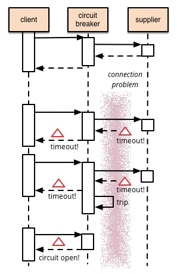
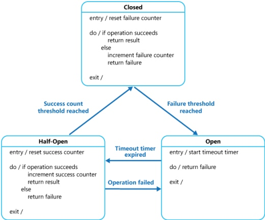

# 熔断模式
##一 问题的产生
在大型的分布式系统中，通常需要调用或操作远程的服务或者资源，这些远程的服务或者资源由于调用者不可以控的原因比如网络连接缓慢，资源被占用或者暂时不可用等原因，导致对这些远程资源的调用失败。这些错误通常在稍后的一段时间内可以恢复正常。

但是，在某些情况下，由于一些无法预知的原因导致结果很难预料，远程的方法或者资源可能需要很长的一段时间才能修复。这种错误严重到系统的部分失去响应甚至导致整个服务的完全不可用。在这种情况下，采用不断地重试可能解决不了问题，相反，应用程序在这个时候应该立即返回并且报告错误。

通常，如果一个服务器非常繁忙，那么系统中的部分失败可能会导致 “连锁失效”（cascading failure）。比如，某个操作可能会调用一个远程的WebService，这个service会设置一个超时的时间，如果响应时间超过了该时间就会抛出一个异常。但是这种策略会导致并发的请求调用同样的操作会阻塞，一直等到超时时间的到期。这种对请求的阻塞可能会占用宝贵的系统资源，如内存，线程，数据库连接等等，最后这些资源就会消耗殆尽，使得其他系统不相关的部分所使用的资源也耗尽从而拖累整个系统。在这种情况下，操作立即返回错误而不是等待超时的发生可能是一种更好的选择。只有当调用服务有可能成功时我们再去尝试。
## 解决之道
熔断器模式可以防止应用程序不断地尝试执行可能会失败的操作，使得应用程序继续执行而不用等待修正错误，或者浪费CPU时间去等到长时间的超时产生。熔断器模式也可以使应用程序能够诊断错误是否已经修正，如果已经修正，应用程序会再次尝试调用操作。

熔断器模式就像是那些容易导致错误的操作的一种代理。这种代理能够记录最近调用发生错误的次数，然后决定使用允许操作继续，或者立即返回错误。

熔断器可以使用状态机来实现，内部模拟以下几种状态。

- 闭合（closed）状态： 对应用程序的请求能够直接引起方法的调用。代理类维护了最近调用失败的次数，如果某次调用失败，则使失败次数加1。如果最近失败次数超过了在给定时间内允许失败的阈值，则代理类切换到断开(Open)状态。此时代理开启了一个超时时钟，当该时钟超过了该时间，则切换到半断开（Half-Open）状态。该超时时间的设定是给了系统一次机会来修正导致调用失败的错误。
- 断开(Open)状态：在该状态下，对应用程序的请求会立即返回错误响应。
- 半断开（Half-Open）状态：允许对应用程序的一定数量的请求可以去调用服务。如果这些请求对服务的调用成功，那么可以认为之前导致调用失败的错误已经修正，此时熔断器切换到闭合状态(并且将错误计数器重置)；如果这一定数量的请求有调用失败的情况，则认为导致之前调用失败的问题仍然存在，熔断器切回到断开方式，然后开始重置计时器来给系统一定的时间来修正错误。半断开状态能够有效防止正在恢复中的服务被突然而来的大量请求再次拖垮。
各个状态之间的转换如下图：


在Close状态下，错误计数器是基于时间的。在特定的时间间隔内会自动重置。这能够防止由于某次的偶然错误导致熔断器进入断开状态。触发熔断器进入断开状态的失败阈值只有在特定的时间间隔内，错误次数达到指定错误次数的阈值才会产生。在Half-Open状态中使用的连续成功次数计数器记录调用的成功次数。当连续调用成功次数达到某个指定值时，切换到闭合状态，如果某次调用失败，立即切换到断开状态，连续成功调用次数计时器在下次进入半断开状态时归零。

实现熔断器模式使得系统更加稳定和有弹性，在系统从错误中恢复的时候提供稳定性，并且减少了错误对系统性能的影响。它通过快速的拒绝那些试图有可能调用会导致错误的服务，而不会去等待操作超时或者永远不会不返回结果来提高系统的响应事件。如果熔断器设计模式在每次状态切换的时候会发出一个事件，这种信息可以用来监控服务的运行状态，能够通知管理员在熔断器切换到断开状态时进行处理。

可以对熔断器模式进行定制以适应一些可能会导致远程服务失败的特定场景。比如，可以在熔断器中对超时时间使用不断增长的策略。在熔断器开始进入断开状态的时候，可以设置超时时间为几秒钟，然后如果错误没有被解决，然后将该超时时间设置为几分钟，依次类推。在一些情况下，在断开状态下我们可以返回一些错误的默认值，而不是抛出异常。

## 要考虑的因素
在实现熔断器模式的时候，以下这些因素需可能需要考虑：

- 异常处理：调用受熔断器保护的服务的时候，我们必须要处理当服务不可用时的异常情况。这些异常处理通常需要视具体的业务情况而定。比如，如果应用程序只是暂时的功能降级，可能需要切换到其它的可替换的服务上来执行相同的任务或者获取相同的数据，或者给用户报告错误然后提示他们稍后重试。
- 异常的类型：请求失败的原因可能有很多种。一些原因可能会比其它原因更严重。比如，请求会失败可能是由于远程的服务崩溃，这可能需要花费数分钟来恢复；也可能是由于服务器暂时负载过重导致超时。熔断器应该能够检查错误的类型，从而根据具体的错误情况来调整策略。比如，可能需要很多次超时异常才可以断定需要切换到断开状态，而只需要几次错误提示就可以判断服务不可用而快速切换到断开状态。
- 日志：熔断器应该能够记录所有失败的请求，以及一些可能会尝试成功的请求，使得的管理员能够监控使用熔断器保护的服务的执行情况。
- 测试服务是否可用：在断开状态下，熔断器可以采用定期的ping远程的服务或者资源，来判断是否服务是否恢复，而不是使用计时器来自动切换到半断开状态。这种ping操作可以模拟之前那些失败的请求，或者可以使用通过调用远程服务提供的检查服务是否可用的方法来判断。
- 手动重置：在系统中对于失败操作的恢复时间是很难确定的，提供一个手动重置功能能够使得管理员可以手动的强制将熔断器切换到闭合状态。同样的，如果受熔断器保护的服务暂时不可用的话，管理员能够强制的将熔断器设置为断开状态。
- 并发问题：相同的熔断器有可能被大量并发请求同时访问。熔断器的实现不应该阻塞并发的请求或者增加每次请求调用的负担。
- 资源的差异性：使用单个熔断器时，一个资源如果​​有分布在多个地方就需要小心。比如，一个数据可能存储在多个磁盘分区上(shard)，某个分区可以正常访问，而另一个可能存在暂时性的问题。在这种情况下，不同的错误响应如果混为一谈，那么应用程序访问的这些存在问题的分区的失败的可能性就会高，而那些被认为是正常的分区，就有可能被阻塞。
- 加快熔断器的熔断操作:有时候，服务返回的错误信息足够让熔断器立即执行熔断操作并且保持一段时间。比如，如果从一个分布式资源返回的响应提示负载超重，那么可以断定出不建议立即重试，而是应该等待几分钟后再重试。（HTTP协议定义了”HTTP 503 Service Unavailable”来表示请求的服务当前不可用，他可以包含其他信息比如，超时等）
- 重复失败请求：当熔断器在断开状态的时候，熔断器可以记录每一次请求的细节，而不是仅仅返回失败信息，这样当远程服务恢复的时候，可以将这些失败的请求再重新请求一次。

## 使用场景

应该使用该模式来：
- 防止应用程序直接调用那些很可能会调用失败的远程服务或共享资源。

不适合的场景
- 对于应用程序中的直接访问本地私有资源，比如内存中的数据结构，如果使用熔断器模式只会增加系统额外开销。
- 不适合作为应用程序中业务逻辑的异常处理替代品

根据上面的状态切换图，我们很容易实现一个基本的熔断器，只需要在内部维护一个状态机，并定义好状态转移的规则，可以使用State模式来实现。首先，我们定义一个表示状态转移操作的抽象类CircuitBreakerState：

```java
public abstract class CircuitBreakerState
{
    //熔断器
    protected static CircuitBreaker circuitBreaker;
    
    protected CircuitBreakerState(CircuitBreaker circuitBreaker) {
        this.circuitBreaker = circuitBreaker;
    }
    // 调用受保护方法之前处理的操作
    public void protectedCodeIsAboutToBeCalled() {
        //如果是断开状态，直接返回,然后坐等超时转换到半断开状态
        if (circuitBreaker.isOpen) {
            throw new OpenCircuitException();
        }
    }

    // 受熔断器保护的方法调用成功之后的操作
    public virtual void protectedCodeHasBeenCalled() {
        circuitBreaker.IncreaseSuccessCount();
    }

    //受熔断器保护的方法调用发生异常操作后的操作
    public virtual void actUponException(Exception e) {
        //增加失败次数计数器，并且保存错误信息
        circuitBreaker.increaseFailureCount(e);
        //重置连续成功次数
        circuitBreaker.resetConsecutiveSuccessCount();
    }
}
```

抽象类中，状态机CircuitBreaker通过构造函数注入；当发生错误时，我们增加错误计数器，并且重置连续成功计数器，在增加错误计数器操作中，同时也记录了出错的异常信息。

然后在分别实现表示熔断器三个状态的类。首先实现闭合状态CloseState：

```java
public class ClosedState extends CircuitBreakerState {
    public ClosedState(CircuitBreaker circuitBreaker) {
        super(circuitBreaker)
        //重置失败计数器
        circuitBreaker.resetFailureCount();
    }
    
    @override
    public void actUponException(Exception e) {
        super.actUponException(e);
        //如果失败次数达到阈值，则切换到断开状态
        if (circuitBreaker.failureThresholdReached()){
            circuitBreaker.moveToOpenState();
        }
    }
}
```
在闭合状态下，如果发生错误，并且错误次数达到阈值，则状态机切换到断开状态。断开状态OpenState的实现如下：
```java
public class OpenState extends CircuitBreakerState {
    private final static Timer timer;

    public OpenState(CircuitBreaker circuitBreaker) {
        timer = new Timer(circuitBreaker.Timeout.TotalMilliseconds);
        timer.Elapsed += TimeoutHasBeenReached;
        timer.AutoReset = false;
        timer.Start();
    }

    // 断开超过设定的阈值，自动切换到半断开状态
    private void timeoutHasBeenReached(object sender, ElapsedEventArgs e) {
        circuitBreaker.moveToHalfOpenState();
    }

    public void protectedCodeIsAboutToBeCalled() {
        super.protectedCodeIsAboutToBeCalled();
        throw new OpenCircuitException();
    }
}
```
断开状态内部维护一个计数器，如果断开达到一定的时间，则自动切换到版断开状态，并且，在断开状态下，如果需要执行操作，则直接抛出异常。

最后半断开Half-Open状态实现如下：

```java
public class HalfOpenState extends CircuitBreakerState {
    public HalfOpenState(CircuitBreaker circuitBreaker)  {
        // 重置连续成功计数
        circuitBreaker.resetConsecutiveSuccessCount();
    }

    public override void actUponException(Exception e) {
        super.ActUponException(e);
        //只要有失败，立即切换到断开模式
        circuitBreaker.moveToOpenState();
    }
    
    public void protectedCodeHasBeenCalled() {
        super.ProtectedCodeHasBeenCalled();
        //如果连续成功次数达到阈值，切换到闭合状态
        if (circuitBreaker.consecutiveSuccessThresholdReached()) {
            circuitBreaker.moveToClosedState();
        }
    }
}
```

切换到半断开状态时，将连续成功调用计数重置为0，当执行成功的时候，自增改字段，当达到连读调用成功次数的阈值时，切换到闭合状态。如果调用失败，立即切换到断开模式。

有了以上三种状态切换之后，我们要实现CircuitBreaker类了:

```java
@data
public class CircuitBreaker {
    private final static object monitor = new object();
    private CircuitBreakerState state;
    private int failureCount;
    public int consecutiveSuccessCount;
    public int failureThreshold;
    public int consecutiveSuccessThreshold;
    public TimeSpan Timeout;
    public Exception LastException;

    public CircuitBreaker(int failedThreshold, int consecutiveSuccessThreshold, TimeSpan timeout) {
        if (failedThreshold < 1 || consecutiveSuccessThreshold < 1) {
            throw new ArgumentOutOfRangeException("threshold", "Threshold should be greater than 0");
        }

        if (timeout.TotalMilliseconds < 1) {
            throw new ArgumentOutOfRangeException("timeout", "Timeout should be greater than 0");
        }

        failureThreshold = failedthreshold;
        consecutiveSuccessThreshold = consecutiveSuccessThreshold;
        timeout = timeout;
        moveToClosedState();
    }
    
    public bool IsClosed {
        return state is ClosedState; 
    }

    public bool IsOpen {
        return state == OpenState; 
    }

    public bool IsHalfOpen {
       return state is HalfOpenState; }
    }

   public void moveToClosedState() {
        state = new ClosedState(this);
    }

   public void moveToOpenState() {
        state = new OpenState(this);
    }

    public void moveToHalfOpenState() {
        state = new HalfOpenState(this);
    }

    public void increaseFailureCount(Exception ex) {
        LastException = ex;
        failureCount++;
    }

    public void resetFailureCount() {
        failureCount = 0;
    }

    public bool failureThresholdReached() {
        return failureCount >= failureThreshold;
    }

    public void increaseSuccessCount() {
        consecutiveSuccessCount++;
    }

    public void resetConsecutiveSuccessCount() {
        consecutiveSuccessCount = 0;
    }
    
    public bool consecutiveSuccessThresholdReached() {
        return consecutiveSuccessCount >= consecutiveSuccessThreshold;
    }
    
    // 执行代理方法， action 需要执行的代理方法
    public void attemptCall(function protectedCode) {
       synchronized (monitor) {
            state.protectedCodeIsAboutToBeCalled();
        }
    
        try {
            protectedCode();
        } catch (Exception e) {
            synchronized (monitor) {
                state.actUponException(e);
            }
            throw e;
        }
    
        synchronized (monitor) {
            state.protectedCodeHasBeenCalled();
        }
    }
    
    public void Close() {
       synchronized (monitor) {
            moveToClosedState();
        }
    }
    
    public void Open() {
       synchronized (monitor) {
            moveToOpenState();
        }
    }
}
```

在该类中
- 首先： 定义了一些记录状态的变量，如failureCount，consecutiveSuccessCount 记录失败次数，连续成功次数，以及failureThreshold，consecutiveSuccessThreshold记录最大调用失败次数，连续调用成功次数。这些对象对外部来说是只读的。

- 定义了一个 circuitBreakerState类型的state变量，以表示当前系统的状态。

- 定义了一些列获取当前状态的方法isOpen, isClose, isHalfOpen,以及表示状态转移的方法moveToOpenState，moveToClosedState等，这些方法比较简单，根据名字即可看出用意。
- 然后，可以通过构造函数将在Close状态下最大失败次数，HalfOpen状态下使用的最大连续成功次数，以及Open状态下的超时时间通过构造函数传进来：
- 在初始状态下，熔断器切换到闭合状态。

- 然后，可以通过attempCall调用，传入期望执行的代理方法，该方法的执行受熔断器保护。这里使用了锁来处理并发问题。

- 最后，提供Close和Open两个方法来手动切换当前状态。

## 测试
以上的熔断模式，我们可以对其建立单元测试。

首先我们编写几个帮助类以模拟连续执行次数：

```java
private static void CallXAmountOfTimes(function codeToCall, int timesToCall) {
    for (int i = 0; i < timesToCall; i++) {
        codeToCall();
    }
}
```
以下类用来抛出特定异常：

```java
private static void AssertThatExceptionIsThrown<T>(Action code) where T : Exception {
    try {
        code();
    } catch (T) {
        return;
    }

    Assert.Fail("Expected exception of type {0} was not thrown", typeof(T).FullName);
}
```
然后，使用NUnit，可以建立如下Case：

```java
@test
public void ClosesIfProtectedCodeSucceedsInHalfOpenState()
{
    var stub = new Stub(10);
    //定义熔断器，失败10次进入断开状态
    //5秒后进入半断开状态
    //在半断开状态下，连续成功15次，进入闭合状态
    CircuitBreaker circuitBreaker = new CircuitBreaker(10, 15, TimeSpan.FromMilliseconds(5000));
    Assert.That(circuitBreaker.IsClosed);
    //失败10次调用
    CallXAmountOfTimes(() => AssertThatExceptionIsThrown<ApplicationException>(() => circuitBreaker.AttemptCall(stub.DoStuff)), 10);

    Assert.AreEqual(10, circuitBreaker.FailureCount);

    Assert.That(circuitBreaker.IsOpen);

    //等待从Open转到HalfOpen
    Thread.Sleep(6000);
    Assert.That(circuitBreaker.IsHalfOpen);
    //成功调用15次
    CallXAmountOfTimes(()=>circuitBreaker.AttemptCall(stub.DoStuff), 15);

    Assert.AreEqual(15, circuitBreaker.ConsecutiveSuccessCount);
    Assert.AreEqual(0, circuitBreaker.FailureCount);
    Assert.That(circuitBreaker.IsClosed);
}
```
这个Case模拟了熔断器中状态的转换。首先初始化时，熔断器处于闭合状态，然后连续10次调用抛出异常，这时熔断器进去了断开状态，然后让线程等待6秒，此时在第5秒的时候，状态切换到了半断开状态。然后连续15次成功调用，此时状态又切换到了闭合状态。

七 结论
在应用系统中，我们通常会去调用远程的服务或者资源(这些服务或资源通常是来自第三方)，对这些远程服务或者资源的调用通常会导致失败，或者挂起没有响应，直到超时的产生。在一些极端情况下，大量的请求会阻塞在对这些异常的远程服务的调用上，会导致一些关键性的系统资源耗尽，从而导致级联的失败，从而拖垮整个系统。熔断器模式在内部采用状态机的形式，使得对这些可能会导致请求失败的远程服务进行了包装，当远程服务发生异常时，可以立即对进来的请求返回错误响应，并告知系统管理员，将错误控制在局部范围内，从而提高系统的稳定性和可靠性。

本文首先介绍了熔断器模式使用的场景，能够解决的问题，以及需要考虑的因素，最后使用代码展示了如何实现一个简单的熔断器，并且给出了测试用例，希望这些对您有帮助，尤其是在当您的系统调用了外部的远程服务或者资源，同时访问量又很大的情况下对提高系统的稳定性和可靠性有所帮助。